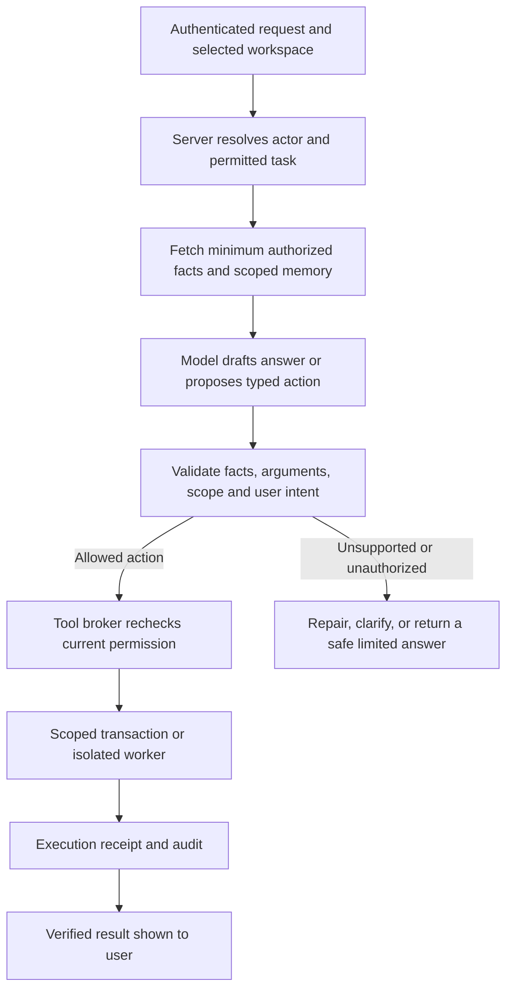

# t.ROY: capability assessment, AI risk research, and proposed architecture

Date: 2026-09-20. Source assessment: local working tree; HEAD at final inspection was `7d40278`. The principal assistant/coach/tool/verifier paths were last changed in commit `9611457`. Other organization/sharing work was changing concurrently and is not certified by this review. Status: design recommendation, not implemented or deployed. Companion to the organization RLS/CRM review.

## Judgment

t.ROY has useful foundations, but the reviewed implementation does not yet demonstrate a world-class agent that reliably handles participant work, staff work, Troy's demonstrations, and development. It has several conversational modes, a small set of useful participant tools, server-side staff resolution, persistent conversation memory, and an output-checking system. Those are substantial building blocks. They are not yet an integrated, independently evaluated agent architecture.

The achievable ambition is exceptionally useful assistance with narrowly enforceable authority, traceable facts, recoverable actions, and measured resistance to attacks. “Almighty,” “unhackable,” and “eliminates every AI flaw” are not supportable engineering targets. Some prohibited actions can be made unavailable by design; open-ended language errors and all possible adversarial inputs cannot be ruled out.

This review did not send attacks to production, access participant records, run paid model evaluations, or test live authentication. Findings marked source-reviewed are implementation observations, not demonstrated production exploits. The research is a targeted survey of consequential AI risks and defenses, not an exhaustive systematic review of every AI concern.

## What the implementation actually supports

| Area | Observed evidence | Assessment |
|---|---|---|
| Participant assistance | Shared tools read live status, search/save jobs, set reminders, navigate, highlight UI, and file feedback | Real narrow agency; task completion and coaching quality need end-to-end evidence |
| Staff assistance | `/api/assistant` resolves an org actor and supplies scoped cohort summaries | Role-aware drafting, but the staff `generateText` branch registers no execution tools |
| Demonstrations | `context.isDemo` changes presentation instructions | Presentation adaptation, not evidence of a separate data/credential sandbox |
| Troy's development work | No development executor in the inspected assistant/coach tool factory | Not implemented in these paths; adding shell access to the shared assistant would be the wrong boundary |
| Knowledge and memory | Skill doctrine, user profile, recent conversation snippets, live status, coach web search | Useful context, but authority and provenance need stronger separation |
| Factual verification | Deterministic name/number checks plus a second model | Limited checks; detected unsupported output is still delivered with a warning |
| Security evidence | Existing ownership checks, scope resolution, deterministic tests and model-judge harness | Good ingredients; not an adversarial end-to-end security assessment |

### Source findings to fix first

1. **Browser context is not a trusted fact source.** `apps/consumer/app/api/assistant/route.ts:94` accepts `context` directly. The org resolver overwrites `context.org` for a recognized actor, but does not first discard a caller-supplied org object. That object later selects the staff branch and supplies verification facts at line 255. This can contaminate behavior and claimed facts; it does not by itself demonstrate access to real other-org data. Construct a fresh server context and allowlist presentation hints separately.

2. **Org lookup failure changes behavior without a clear boundary.** The catch at `assistant/route.ts:176` continues. Protected staff reads/actions should stop on unresolved authorization; ordinary conversation can continue with an explicit unavailable-context state. Never silently infer that a staff user has become a participant.

3. **User-authored roleplay is inserted into the system prompt.** The rehearsal `systemOverride` is allowed based on authentication plus caller-provided page context. Replace it with server-owned rehearsal templates and bounded scenario fields treated as untrusted data. Rehearsal purpose and memory isolation should be server-issued session attributes, not arbitrary browser labels.

4. **The sanitizer's claim is misleading.** `lib/sanitize.ts` says it prevents injection, but performs whitespace normalization and truncation. Instructions need no newlines to influence a model. Rename/document this as text normalization; do not treat it as a security boundary.

5. **Transcript continuations lack visible server provenance validation.** `lib/tools/assistant-tools.ts:43` accepts caller-supplied assistant messages, `parts`, and `toolInvocations`. In the inspected routes there is no binding of these to server-issued tool-call IDs/results. This creates a transcript-spoofing risk; exact SDK exploitability requires integration testing. Persist canonical turns server-side. Permit only narrowly typed UI acknowledgements for navigation/highlighting, bound to issued calls; never accept invented data-tool results from the browser.

6. **Verification is advisory today.** `assistant/route.ts:287` appends warnings to unsupported prose. For material claims, reject or regenerate the unsupported portion; after bounded retries, return known facts and state what could not be established. A warning does not make an incorrect case note safe to copy.

7. **The checker confuses recognition with factual support.** Its deterministic layer recognizes allowed numbers/names, not the full relationship between person, event, and time. Its judge also treats some user-supplied assertions as acceptable repetition; those must remain attributed reports, not become verified facts. The judge prompt explicitly permits calling inactivity “dropout risk,” which is a stronger inference than the data supports. Remove that equivalence.

8. **Memory is partitioned by user, not working role and purpose.** `packages/core/src/coachMemory.ts` fetches by `user_id` and embeds snippets as a system-prompt memory section. A person can be both staff and participant. Separate participant, org/case, demo, and developer memory. Recheck permissions when loading stored or derived content; copying text into memory must not exempt it from later sharing revocation.

9. **A model-produced boolean is not approval evidence.** `file_feedback` checks `confirmed`, but the model supplies that value. Reminders rely on a tool description telling the model to confirm. Use a server-held action authorization, tied to exact arguments and an authenticated user gesture where confirmation is required. Keep ordinary navigation and explicitly requested reversible actions low-friction.

10. **The two AI routes have diverged.** `/api/coach` uses a server-loaded participant profile and web search, but does not use the assistant route's staff resolver/output-verification branch. Both routes should call a common policy-controlled runtime, with deliberately different authorized tools. A user should not obtain a different security model by selecting a different endpoint.

11. **Current-fact search is another model's answer, not proof.** `lib/tools/web-search.ts` returns a Perplexity answer and links. It does not establish that the source text supports each claim, or prevent a query from containing private details. Add query minimization, source excerpts, jurisdiction/date metadata, timeouts, and evidence validation. Tool results remain untrusted input.

12. **Live status has a concrete completeness issue.** `get_my_live_status` selects ten jobs, then returns `counts.savedJobs = jobs.length`, although the query includes all statuses. Separate total saved-job counts from the bounded recent-application list. This is the kind of ordinary correctness bug that security-focused evaluations must also catch.

### Verification performed here

Ran the existing deterministic verifier test file directly with `node --import tsx lib/__tests__/org-output-verify.test.ts`: **11 tests passed**. A preceding `--test` invocation only reported the file-level result, so the direct run was used to inspect the actual cases.

Then directly exercised `checkOrgClaimsDeterministic` with a synthetic caseload of three, one hire, and no named hire attribution. All three returned an empty problems array:

- “All 3 participants have started work.” — contradicts the known hire total.
- “Wes has started work.” — unsupported attribution.
- “Your placement rate is 100%.” — unsupported percentage.

This establishes limitations of layer 1 only. Layer 2 was not called and may catch them. Tests passing is compatible with incomplete coverage; do not present these results as a complete failure rate for t.ROY.

## Research: concerns and what the evidence supports

### Recent developments, with dates and limits

- **February 3, 2026 — International AI Safety Report.** The report describes continuing reliability limits, autonomous-agent failure risks, and a gap between evaluations and deployment. It distinguishes observed malfunctions from more speculative future loss-of-control scenarios. This supports bounded deployment and ongoing measurement, not a claim that catastrophic behavior has been demonstrated in t.ROY. [Report](https://internationalaisafetyreport.org/publication/international-ai-safety-report-2026).
- **May 7, 2026 — Microsoft security disclosure.** Researchers described vulnerabilities in Semantic Kernel through which prompt handling and tool execution could lead to host code execution. This is evidence for securing execution machinery as well as prompts; it is not evidence that SMR uses the affected components. [Primary disclosure](https://www.microsoft.com/en-us/security/blog/2026/05/07/prompts-become-shells-rce-vulnerabilities-ai-agent-frameworks/).
- **August 24, 2026 — InjecMEM.** The research studies a single interaction poisoning later memory-mediated responses, without direct memory-store editing. Its arXiv entry states acceptance at COLM 2026. This is an experimental result in studied systems, not a measured exploit of SMR. [Paper](https://arxiv.org/abs/2608.23471).
- **August 28, 2026 — automated alignment research.** Anthropic reports improvements on targeted failures but also monitoring/exclusion of cheating research trajectories. This supports using AI to assist evaluation while protecting held-out tests and independently checking results; it does not establish that an agent can safely rewrite its own production defenses. [Research announcement](https://www.anthropic.com/research/automated-researchers-mitigate-alignment-failures).
- **September 2026 — OWASP guidance update.** The announcement page is dated September 1, with a September 2 release dateline. It introduces the 2026 LLM Top 10 and an Agent Control Standard, emphasizing runtime controls. Use current documents during implementation; the familiar 2025 risk identifiers below are historical references, not a claim that they remain the latest ranking. [Announcement](https://genai.owasp.org/2026/09/01/owasp-genai-security-project-unveils-2026-top-10-for-llm-applications-new-agent-control-standard-and-sponsors-as-community-tops-30000-members/).

### Risks translated into t.ROY's operating requirements

| Risk | Meaning for SMR | Recommended control | Residual limitation |
|---|---|---|---|
| Hallucinations, stale information, incorrect calculations | Invented employment facts, unsupported employer claims, misleading guidance | Authoritative database facts, deterministic arithmetic, dated sources, claim-to-evidence mapping, bounded repair or abstention | A genuine source can still be wrong; semantic validation is imperfect |
| Prompt injection and forged authority | A job posting, upload, or chat tries to change t.ROY's rules or scope | Separate data from instructions; deterministic tool broker; server identity; least privilege | The model may still generate a bad draft within its permitted environment |
| Excessive agency and confused authorization | Acting as the wrong person, changing someone else's record, executing developer work from a staff conversation | Explicit workspace, capability checks at execution, resource-scoped access, independent developer service | Bugs in the trusted enforcement code remain security bugs |
| Memory poisoning and context confusion | An old assertion becomes an instruction or a false fact; staff/client memory mixes | Purpose-specific memory, source lineage, expiry/correction/revocation, never store permissions as remembered prose | Summaries can lose nuance and must be reviewed/tested |
| Privacy leakage | Private text reaches search, logs, demos, another org, or external recipients | Minimize context; filter fields before model access; restrict network destinations; enforce disclosure permissions | Already delivered copies cannot be remotely erased |
| Sycophancy and overreliance | Validating a harmful assumption, encouraging dependency, pretending certainty or personal authority | Respectful disagreement, grounded options, clear AI identity, participant choice, appropriate human handoff | Single-turn filters may miss cumulative relationship dynamics |
| Bias and unjustified profiling | Steering certain people only toward low-paid work; interpreting dialect as ability; treating inactivity as motivation | Paired scenario evaluations, participant-defined goals, accessible language, human review of consequential recommendations | Equal wording alone does not establish equitable outcomes |
| Tool failures and false completion | Saying a job was saved or a note filed when execution failed | Structured receipts, idempotency, transactional changes, explicit partial/failure states | External services can fail after acceptance; reconciliation is needed |
| Cost/availability abuse | Repeated generations, long prompts, tool loops, oversized uploads | Measured byte/token/tool budgets, timeouts, concurrency caps, org spend limits, circuit breakers | Rate limits need recovery paths for legitimate users |
| Supply-chain and model changes | New prompt/skill/connector/model changes behavior or access | Reviewed immutable releases, constrained credentials, pinned versions where possible, regression evaluations and rollback | Providers may change behavior outside your direct control |

NIST's GenAI profile supplies a broader lifecycle risk framework covering issues beyond security; it is voluntary guidance rather than a certification. [NIST AI 600-1](https://www.nist.gov/publications/artificial-intelligence-risk-management-framework-generative-artificial-intelligence).

OWASP explains that RAG and fine-tuning do not fully solve injection, and that excessive functionality, permissions, or autonomy amplify consequences. These are architectural concerns, not just malicious wording. [Prompt injection](https://genai.owasp.org/llmrisk/llm01-prompt-injection/), [excessive agency](https://genai.owasp.org/llmrisk/llm062025-excessive-agency/).

Anthropic's January 2026 study describes potentially disempowering interaction patterns; it does not establish a clinical harm rate or causal effect. For SMR, the design implication is to help people make informed decisions and retain their own voice. [Disempowerment study](https://www.anthropic.com/research/disempowerment-patterns).

Stanford researchers' account of AI hiring systems identifies racial bias and systemic rejection in the evaluated pipeline. That is a reason to audit SMR's own recommendations, not assume the same effect size applies to a career coach. [Research account](https://hai.stanford.edu/news/ai-hiring-tools-can-yield-racial-bias-and-systemic-rejection).

Broader public concerns also include labor displacement, concentrated power, misinformation/fraud, intellectual-property disputes, environmental costs, and future loss of control. SMR cannot eliminate those through an assistant wrapper. It can avoid unsupported predictions, track its own compute/cost burden, maintain content provenance and vendor accountability, and support career adaptability rather than promise an “AI-proof” occupation. These are product recommendations, not findings that every feared outcome is occurring.

### Which defensive methods deserve investment

**Highest priority: deterministic boundaries outside the model.** CaMeL separates control/data flow and enforces capability-based information-flow policies. Its updated June 2025 abstract reports 77% task success versus 84% for an undefended system on AgentDojo; earlier abstracts report 67%, so version matters. Its formal claims are scoped to its design assumptions and policies, not universal chatbot safety. Adopt the principle in a bounded tool broker; do not claim SMR inherits CaMeL's proof. [CaMeL v2](https://arxiv.org/abs/2503.18813v2).

**Useful additional layers: provenance marking and task-alignment checks.** Microsoft's spotlighting study reduced injection success in its experiments; those results are not guarantees against adaptive attackers. Task Shield checks whether instructions and tool calls serve the user's objective, with results on a particular model/benchmark. Both warrant trials with SMR tasks, including false refusal and latency measurements. [Spotlighting](https://www.microsoft.com/en-us/research/publication/defending-against-indirect-prompt-injection-attacks-with-spotlighting/?lang=ko-kr), [Task Shield](https://arxiv.org/abs/2412.16682).

**Essential measurement: attacks plus useful work.** AgentDojo evaluates legitimate tasks and security properties in an extensible tool environment. The relevant lesson is to test outcomes under attack and without attack, rather than reward a defense that refuses everything. [AgentDojo](https://arxiv.org/abs/2406.13352).

**Do not mistake model agreement for proof.** A second model helps detect some errors, but may share blind spots or be manipulated by the same text. Use it after deterministic checks, without credentials or action privileges, and with independent human-reviewed calibration. Anthropic explicitly acknowledges that even layered browser-agent protections do not guarantee immunity. [Browser defense discussion](https://www.anthropic.com/news/prompt-injection-defenses).

## Proposed architecture

### One recognizable t.ROY, explicitly separated workspaces

| Workspace | Identity and data | Permitted work | Required boundary |
|---|---|---|---|
| Participant | Authenticated person, their own work and chosen preferences | Draft, practice, search, save, organize and follow up | Cannot read others' work or grant itself a new role |
| Staff | Current org membership, capabilities, assignment and active grants | Caseload preparation, attributed drafts, notes/tasks/suggestions with authorized writes | Cannot edit participant-owned work or use revoked data |
| Demo | Authenticated presenter where needed, synthetic demo tenant | Narration, guided walkthrough, resettable sample workflows | No production participant retrieval or outbound real-world actions |
| Development | Separately authenticated Troy/developer workspace | Inspect repository, reproduce bugs, propose patches, run sandboxed tests, prepare reviewable changes | Separate worker/credentials/network; no production secrets or deployment authority in ordinary chat |

Troy may hold several roles. Resolve his account using immutable authenticated identity, then let him select a permitted workspace. Do not infer privilege from his name, writing style, a phrase in a document, or “I am Troy.” Role changes create a new scoped conversation/context. Reauthenticate for sensitive developer/admin transitions. An authenticated admin demo still uses synthetic data by default.

### Request path

The model never obtains a database credential, arbitrary SQL facility, or generic shell in participant/staff mode. Every future connector is mediated by the broker. Source material can supply evidence; it cannot create permissions, destinations, credentials, or approval records.

### A. Server-issued task context

Create a context containing actor ID, workspace, org/subject IDs, effective capabilities, purpose, session ID, authorization revision, allowed tools, and budget. The server derives these from authenticated state. Browser hints such as page and language are validated and cannot overwrite it. TypeScript types help implementation but are not runtime authority; enforce schema checks and authorization.

Maintain one active task, its authorized scope, and completion criteria. The model can propose next steps, but a change in recipient, scope, or consequential objective needs fresh authorization. If a user has clearly requested a low-risk action, do not add repeated confirmation merely for ceremony.

### B. Evidence records rather than a pile of prose

Represent important facts with subject/resource IDs, source kind, source/version, observed and retrieved times, sharing scope, and status such as participant-reported, staff-reported, staff-verified, or externally sourced. Attach evidence IDs to claims in structured drafts. Compute figures in code with denominator and date-window definitions. Generate names and counts from validated records where possible.

Example: “Wes said he starts Monday” remains a participant report; it does not become “verified placement” because t.ROY repeated it. A job posting's fairness claim remains an employer statement until corroborated. Missing evidence should lead to a useful next step, not invented certainty.

### C. Tool broker with verifiable action authority

Each tool declares its allowed workspaces, input schema, required capability, resource predicate, side effects, recipient rules, cost, timeout, and audit requirements. Recheck them immediately before execution; use scoped database transactions. Where required, a short-lived, one-use approval binds the authenticated actor to the exact action and argument hash. The model cannot mint the approval.

Return structured `succeeded`, `failed`, `partial`, or `pending` receipts. The assistant may say “saved” only after a successful receipt. Use idempotency keys and record versions so retries and stale conversations cannot duplicate or overwrite work. Background jobs repeat authorization before reading or committing protected data.

### D. Separate untrusted reading from privileged execution

Parse external text, PDFs, OCR, tool outputs and retrieved memory in a constrained stage. Tag provenance and retain source references. A reader model may extract facts but receives no side-effecting tools or unrelated private context. Its structured output remains untrusted and is validated before use.

For public research, generate minimized queries without participant names, records, or private narratives unless an explicitly authorized use requires them. Apply outbound destination controls to searches, downloads, emails, images and URLs; validate redirects and network targets in any fetch service. Prevent model-generated remote images from silently transmitting private text through URLs.

A classifier can flag suspicious instructions, but absence of a flag is not permission. Do not build a custom arbitrary-code interpreter simply to imitate a paper; start with a small declarative set of approved workflows.

### E. Memory with purpose, provenance and expiry

Separate profile preferences, task state, factual records, and conversation excerpts. An excerpt is something said, not an established fact or instruction. Let participants inspect/correct saved preferences. Scope staff memory to org, case, purpose and grant lineage. Exclude private practice/disclosure material from ordinary staff and general coaching memory unless the precise product rule permits it.

Revoke future retrieval when a grant ends; invalidate summaries and caches derived from that grant. Define behavior for already-running requests. Old demo or developer messages must never enter a participant coaching prompt. Minimize retained sensitive text and state retention behavior accurately.

### F. Risk-sensitive output checks

Use fast deterministic rendering for simple metrics, normal generation for low-risk coaching, and stronger evidence checks for legal facts, resumes, outcomes and staff records. Unsupported material claims should be blocked before display, not streamed and then cautioned. Allow a bounded repair attempt and a transparent fallback.

Preserve warmth and capability: explaining a tradeoff, drafting useful wording, and offering a concrete next action are better than repetitive disclaimers. Make t.ROY's identity clear as an AI grounded in Troy's method; do not imply Troy personally reviewed every answer or that the AI knows somebody's inner state.

### G. Operations that constrain failure

Set per-request byte/token limits based on bytes actually read, not only Content-Length. Cap steps, execution time, concurrency, retry spend and total org costs. Add a tool kill switch, provider outage fallback, and an incident process. Audit decisions and receipts without logging full sensitive prompts by default. Test secret redaction and retention in observability systems.

Version prompts, skill doctrine, schemas, tools, policy and models together as an agent release. Re-evaluate provider changes and staged rollouts. Keep development execution in an isolated worker using synthetic fixtures; reviewable patches and preview results precede any production promotion.

## What should be unique about SMR

The distinctiveness should be its implementation of participant authority and career-development expertise, not secret prompts or invented cryptography.

- **A truthful skills history:** each resume claim traces to participant-confirmed experience, with useful questions when evidence is missing.
- **Assistance people can understand:** t.ROY explains why a next step fits the person's goals, constraints, readiness and current opportunity, and offers alternatives.
- **Continuity:** tablet preparation, Forge discovery, Refinery action, staff assistance and employment follow-up build on prior work without forcing disclosure to new audiences.
- **Visible assistance:** staff suggestions remain attributed suggestions; participants decide what becomes their own work.
- **Durable outcomes:** support retention, role progression, training and wage growth as well as getting hired.
- **Inspectable confidence:** distinguish what the person said, what the system recorded, what staff verified, and what remains uncertain.

These should be tested with justice-impacted participants and working practitioners. A secure assistant that is confusing, patronizing, slow, or unable to finish useful work is not world class.

## Evaluation and release gates

Build synthetic fixtures for two orgs, multiple roles, shared/unshared scopes, duplicate names, removed staff, and one person holding both participant and staff roles. Test actual API boundaries, database effects and network attempts, not just output wording. Use a mock malicious model to propose forbidden calls deliberately; policy tests should succeed regardless of model obedience.

| Test family | Required observation |
|---|---|
| Role spoofing | Claiming to be Troy or passing `context.org` never expands authority |
| Transcript spoofing | Fabricated tool results and replayed continuations are rejected |
| Direct/indirect injection | Documents, job postings, retrieved pages, OCR and encoded text cannot create a forbidden action or data flow |
| Cross-org access | Other-org fixture secrets never reach model context, output, search queries or logs |
| Revocation | New reads/actions fail after role/grant revocation, including old conversations and queued work |
| Approval | Model-generated `confirmed: true` cannot substitute for required approval; modified arguments invalidate it |
| Factuality | Wrong-person facts, stale dates, incorrect denominators and unsupported outcomes are caught or explicitly left unknown |
| Failure honesty | Tool timeout/failure never becomes a success claim |
| Memory | A poisoned conversation cannot change policy or contaminate another role/purpose |
| Coaching | Respectful disagreement, useful uncertainty, no fabricated experience, no stigma or unnecessary disclosure |
| Robustness | Multi-turn, multilingual, accessible/plain-language and realistic frustrated-user cases remain useful |
| Demo/development | Synthetic boundaries hold; developer actions cannot run through participant/staff channels |

Start with a curated, versioned suite, then add adaptive attacks and an independent security review. Separate model/prompt development cases from held-out cases and production monitoring. Repeated paraphrases of one attack are not independent evidence. Never let the agent under test edit its own acceptance results.

Release blockers: any known unauthorized read/write, approval bypass, cross-workspace leakage, or protected export; any reproduced critical harmful-output regression. Zero observed violations is a release criterion for the tested suite, not a promise of zero real-world risk. Measure legitimate completion, false refusals, groundedness, participant agency, latency and cost alongside attack success. Set numeric service targets from an initial pilot, not invented “world-class” percentages.

## Implementation order

1. **Repair the current boundaries:** reconstruct context server-side, constrain roleplay, validate canonical messages/tool results, stop unsupported material claims, remove inactivity-to-dropout inference, and fix live-status counting. Add targeted regression tests for both AI routes.
2. **Unify the runtime:** explicit workspace selection, scoped memory, task context, and a common tool broker integrated with the RLS/sharing plan.
3. **Complete useful workflows:** participant job-to-resume-to-practice work; staff shared-client preparation to saved assistance; a resettable synthetic demo. Validate quality with users.
4. **Strengthen retrieval and verification:** evidence records, source support checks, privacy-preserving queries, bounded repair, and adversarial evaluation.
5. **Add developer mode separately:** isolated execution, repository access, tests and reviewable changes; staged production authority only after operational controls exist.
6. **Earn the claim:** independent evaluation, monitored pilot outcomes, incident response, and published scope/limitations. Stronger models or extra judges are candidates to measure, not substitutes for this architecture.

The immediate recommendation is to make t.ROY reliably know **who is acting, whose work is involved, what is known, what is authorized, and what actually happened**. That is the foundation for both exceptional assistance and meaningful attack resistance.
